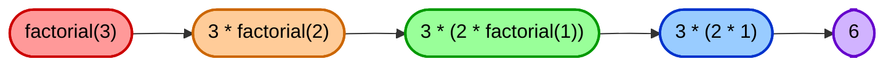

<h1 align="center">🚀 Data Structures Lab – Recursion (Java)</h1>


---

## 📺 Lecture Video

Watch the full Recursion Lab lecture on YouTube:
https://youtu.be/KIPyIDNcnGM

---

## 1. 🌟 Introduction

Recursion is a **powerful programming technique** where a function calls itself to solve a smaller version of a problem.  
It is especially useful for:

- Breaking down **complex problems** into simpler ones 🧩  
- Traversing **arrays** and **linked lists** 🔗  
- Solving **mathematical sequences** like factorials and Fibonacci numbers 📊  

**Key Concepts:**

1. **Base Case** 🛑: Stops recursion and prevents infinite loops.  
2. **Recursive Case** 🔄: Reduces the problem size and calls the same function again.  
3. **Recursive Thinking** 💡: Think about how a large problem can be expressed in terms of smaller instances of itself.  

> Time Complexity: O(n)
> Space Complexity: O(n) (stack frames)
---

## 2. 📂 Repository Structure

```bash
DS-Lab-Recursion/
│
├─ README.md
├─ src/
│ ├─ examples/
│ │ ├─ Recursion.java
│ │ ├─ SLL.java
│ │ └─ DLL.java
│ ├─ activities/
│ │ ├─ SumSLL.java
│ │ ├─ LastNodeCLL.java
│ │ ├─ CountNodesCLL.java
│ │ └─ ReverseSLL.java
│ └─ chapters/
│ └─ Lecture03-Recursion.pdf
└─ assignments/
└─ README.md
```

---

## 3. 🖥 Examples – Building Recursive Functions.

In this section, we explain the **idea behind each example**, how to **plan and write the recursive function**, and how it connects to arrays and linked lists. Think of it as a step-by-step recipe to design recursion.

### 3.1 ✨ Printing a Name Multiple Times

**Goal:** Print a name multiple times using recursion.

**How to think recursively:**

1. **Identify the base case** 🛑: When should the recursion stop?
  - Here: when the number of times to print reaches 0.
2. **Define the recursive case** 🔄: What smaller problem will you solve in each call?
  - Here: print once, then call the function to print the remaining times.
3. **Write the function:**
  - Function accepts a count.
  - Print the name once.
  - Call itself with count − 1.
4. **Mermaid Visualization:**


> **Key Takeaway:** Recursion can replace loops and helps you **think in terms of repeated actions.**

---

### 3.2 🟢 Printing an Array Forward and Backward

**Goal:** Traverse an array using recursion (forward and backward).

**Step-by-step plan:**

1. **Base case** 🛑: When the index reaches the array length, stop recursion.
2. **Recursive case** 🔄:
  - Forward: process the current element, then call the function for the next index.
  - Backward: call the function for the next index first, then process the element (to reverse the order).
3. **Mermaid Forward Example:**


4. **Mermaid Backward Example:**

```mermaid
flowchart LR
    A(["arr[0]"])
    B(["arr[1]"])
    C(["arr[2]"])
    D(["print arr[2]"])
    E(["print arr[1]"])
    F(["print arr[0]"])
    G(["Stop"])

    A --> B --> C --> D --> E --> F --> G

    %% Colors with black font and rounded nodes
    style A fill:#ff9999,stroke:#cc0000,stroke-width:2px,color:#000000,rx:10,ry:10
    style B fill:#ffcc99,stroke:#cc6600,stroke-width:2px,color:#000000,rx:10,ry:10
    style C fill:#99ff99,stroke:#009900,stroke-width:2px,color:#000000,rx:10,ry:10
    style D fill:#99ccff,stroke:#0033cc,stroke-width:2px,color:#000000,rx:10,ry:10
    style E fill:#ffe680,stroke:#cc9900,stroke-width:2px,color:#000000,rx:10,ry:10
    style F fill:#ffb3e6,stroke:#cc3399,stroke-width:2px,color:#000000,rx:10,ry:10
    style G fill:#d1b3ff,stroke:#6600cc,stroke-width:2px,color:#000000,rx:10,ry:10
```



> **Tip:** This example connects recursion to arrays and helps you **understand order of operations** in recursive calls.

---

### 3.3 🔵 Finding Maximum in an Array

**Goal:** Find the largest element using recursion.

**Recursive thinking steps:**

1. **Base case:** Last element in the array → **return that element** (not `0`), so the function works even if all numbers are negative.
2. **Recursive case:** Compare current element with the maximum of the rest of the array.
3. **Break down the problem:**
     - `max(arr[i..n-1]) = max(arr[i], max(arr[i+1..n-1]))`
4. **Visualization:**


> **Key Takeaway:** Recursion is powerful for **divide-and-conquer problems**.

---

### 3.4 🟣 Factorial

**Goal:** Compute n! using recursion.

**Step-by-step:**

1. **Base case:** `factorial(0) = 1` or `factorial(1) = 1`.
2. **Recursive case:** `factorial(n) = n * factorial(n-1)`.
3. **Build it gradually:**
  - Start with small n (e.g., 3), trace the recursive calls.
4. **Visualization:**



> **Tip:** Factorial is the classic example to **practice base and recursive steps.**

---

### 3.5 🟡 Fibonacci Sequence

**Goal:** Compute the nth Fibonacci number recursively.

**Thinking recursively:**
1. **Base cases:** `fib(0)=0`, `fib(1)=1`.
2. **Recursive case:** `fib(n)` = `fib(n-1)` + `fib(n-2)`.
3. **Visualize recursion tree:**


4. Notice **overlapping subproblems** – this helps prepare for memoization later.

> **Key Takeaway:** Recursion mirrors **mathematical definitions** directly and elegantly.

---

### 3.6 💚 Counting Nodes in a Singly Linked List (SLL)

**Goal:** Count the number of nodes recursively.

**Steps to design function:**
1. **Base case:** Current node is null → return 0.
2. **Recursive case:** Return `1 + count of rest of the list`.
3. **Visualize:**


> **Tip:** Connects recursion with **dynamic data structures** like linked lists.

---

### 3.7 💜 Traversing a Doubly Linked List (DLL) Recursively

**Goal:** Traverse forward and backward recursively.

**Forward traversal steps:**
1. **Base case:** node is null → stop.
2. **Recursive case:** print current node → call function on `next`.

**Backward traversal steps:**
1. **Base case:** node is null → stop.
2. **Recursive case:** print current node → call function on `prev`.
3. **Mermaid Forward Example:**


> **Key Takeaway:** Recursion works naturally in **bidirectional structures**, teaching traversal patterns beyond arrays.

---

### ✅ Overall Recursion Tips

- Always **start by identifying the base case**.
- Think: “How can I reduce the problem in each step?”
- **Trace small examples** before writing the function.
- Recursion is **a way to think about repeating or nested tasks** naturally.

---

## 4. 🎯 Activities (Solutions to be added later)

| Activity                   | Description                                                   |
|----------------------------|---------------------------------------------------------------|
| Sum elements in SLL 🧮     | Recursively sum all elements in a singly linked list.         |
| Find last node in CLL 🔄   | Recursively identify the last node in a circular linked list. |
| Count nodes in CLL 🔢      | Recursively count nodes in a circular linked list.            |
| Reverse SLL 🔁             | Reverse a singly linked list using recursion.                 |

> ⚠️ Note: Solutions are not uploaded yet. Videos and step-by-step solutions will be linked here once available.

---

## 5. 📖 Chapter Materials

- **[Lecture 03 - Recursion.pdf](src/chapters/Lecture%2003%20-%20Recursion.pdf)**
  💡 Recommended to read while running the code to fully understand recursion steps.

---

## 6. 6. 🏃 Running Examples

1. **Clone repository:**

```bash
git clone https://github.com/Maryam-Skaik/java-ds-lab-recursion.git
```

2. **Navigate to `src/examples`:**

```bash
cd java-ds-lab-recursion/src/examples
```

3. **Compile Java files:**

```bash
javac *.java
```

4. **Run an example:**

```bash
java Recursion
```

5. Check output and follow comments to understand recursion flow.

---

## 📂 Recursion Module – Assignments

A new assignment set has been added for **Lecture 03 – Recursion**.  
It includes tasks on recursive arrays, linked lists (SLL, DLL), and classic recursive functions.

You can find it here:

👉 [`/assignments/`](assignmnet/readme.md)

The assignment explanation video is available on YouTube.  
Students must watch the full video, write all tasks, and implement them using recursion only.

---

## 7. 💡 Tips for Students

- Identify **base case first** 🛑
- Think **how the problem reduces** 🔄
- Use **print statements** to visualize recursion 👀
- Start with arrays ➡️ then move to linked lists
- Recursion can replace **loops**, but sometimes may need **optimization**

---

### Happy Learning! 🚀

This lab will make recursion **clear, visual, and fun**, connecting arrays and linked lists in Java.
