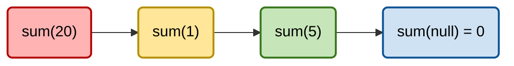
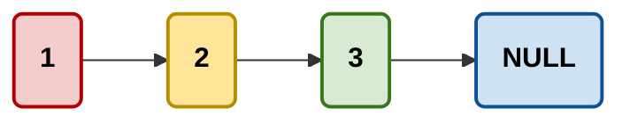
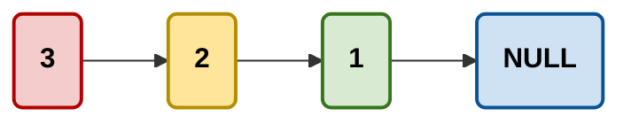
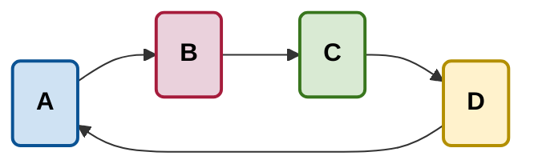
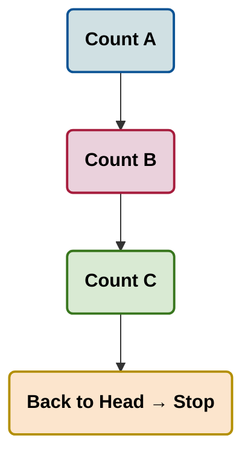

# 🧠 Recursion Activities – Data Structures Lab (Java)

This folder contains **recursion-focused activities** designed for the **Data Structures Laboratory** course. The activities intentionally combine **recursion** with previously studied data structures—**Singly Linked Lists (SLL)** and **Circular Linked Lists (CLL)**—to help students understand *when*, *why*, and *how* recursion should be applied.

> 🎯 **Core idea:** Linked lists are *naturally recursive*. Each node represents one step, and the rest of the list is a smaller version of the same problem.

---

## 📂 Folder Structure

```
activities/
└── recursion/
    ├── SLL.java   // Singly Linked List recursion activities
    └── CLL.java   // Circular Linked List recursion activities
```

---

## 🎥 Video Explanation
For a complete step-by-step walkthrough of all recursion activities, watch the explanation video:
[Recursion Activities Solutions – DS Lab](https://youtu.be/fcldPtPGkt8)

---
## 🤔 Why Use Recursion Here?

A linked list is defined recursively:
- A node contains data
- A node points to **another linked list**

This makes recursion a **natural fit** for operations such as traversal, counting, summation, and reversal.

However, recursion must be applied **carefully**, especially with **circular linked lists**, where there is **no `null` reference** to stop execution.

---

## 🧩 Activity 1: Sum Elements in Singly Linked List (SLL)

**File:** `SLL.java`

### 🔍 Problem
Compute the sum of all elements in a singly linked list using recursion.

### 💡 Why This Works
Each recursive call:
- Processes **one node**
- Delegates the rest of the list to the next call

### ✅ Base Case
```java
if (node == null) return 0;
```
Reaching `null` means the list has ended.

### 🔁 Recursive Case
```java
return node.element + sumNodes(node.next);
```

### 📐 Recursive Call Stack (Visualized)


### 📊 Complexity
- **Time:** `O(n)`
- **Space:** `O(n)` (recursive stack)

---

## 🧩 Activity 2: Reverse Singly Linked List (SLL)

**File:** `SLL.java`

### 🔍 Problem
Reverse a singly linked list using **recursion only** (no loops).

### 💡 Key Insight
The list is reversed **while recursion unwinds**.
The last node becomes the new head.

### ✅ Base Case
```java
if (node == null || node.next == null) return node;
```

### 🔁 Pointer Reassignment (Critical Step)
```java
node.next.next = node;
node.next = null;
```

### 📐 Pointer Transformation Diagram

**Before Reversal:**


**After Reversal:**


---

## 🧩 Activity 3: Find Last Node in Circular Linked List (CLL)

**File:** `CLL.java`

### 🔍 Problem
Find the last node in a circular linked list using recursion.

### ⚠️ Why This Is Dangerous
Circular lists **never reach `null`**.
Using `node == null` as a base case would cause **infinite recursion**.

### ✅ Correct Base Case
```java
if (node.next == head) return node;
```
This guarantees exactly **one full cycle**.

### 📐 Circular Traversal Visualization


---

## 🧩 Activity 4: Count Nodes in Circular Linked List (CLL)

**File:** `CLL.java`

### 🔍 Problem
Count the number of nodes in a circular linked list recursively.

### 💡 Strategy
- Count the current node
- Stop when the traversal returns to `head`

### ✅ Base Case
```java
if (node.next == head) return 1;
```

### 🔁 Recursive Case
```java
return 1 + countNodes(head, node.next);
```

### 📐 Recursive Counting Flow


### 📊 Complexity
- **Time:** `O(n)`
- **Space:** `O(n)`

---

## 🚫 Common Student Mistakes

❌ Using `null` as a base case in circular lists<br>
❌ Forgetting to stop recursion at `node.next == head`<br>
❌ Reversing data instead of pointers<br>
❌ Not tracing recursive calls manually<br>

---

## 🎯 Learning Outcomes

After completing these activities, students should be able to:

- Explain **why recursion works naturally with linked lists**
- Identify **correct base cases** for different structures
- Avoid infinite recursion in circular lists
- Trace recursion using call stacks and diagrams
- Reverse linked lists recursively with confidence

---

## ▶️ How Students Should Use This Code

1. Read the problem carefully
2. Identify the base case *before writing code*
3. Draw the recursion tree or call stack
4. Run the `main()` methods with multiple test cases
5. Modify and extend the code

---

## 👩‍🏫 Instructor

**Maryam Skaik**  
Teaching Assistant – Data Structures & Algorithms  
Java | Linked Lists | Recursion

---

> 📌 These implementations are for **educational purposes**. Understanding the logic is more important than memorizing the code.
